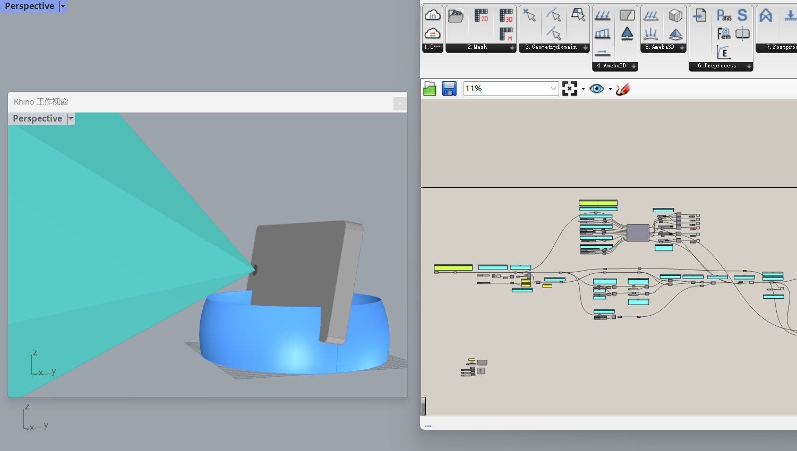
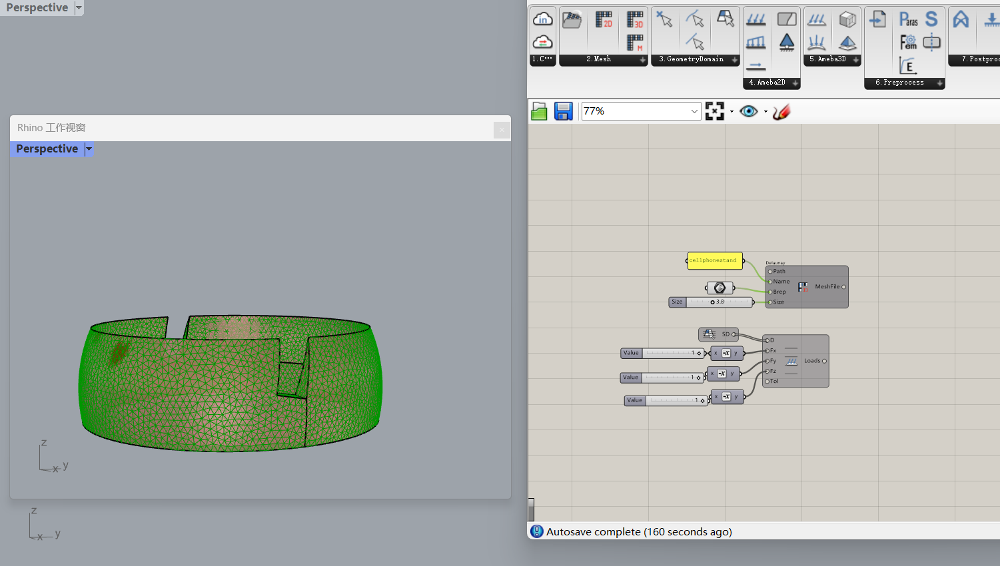
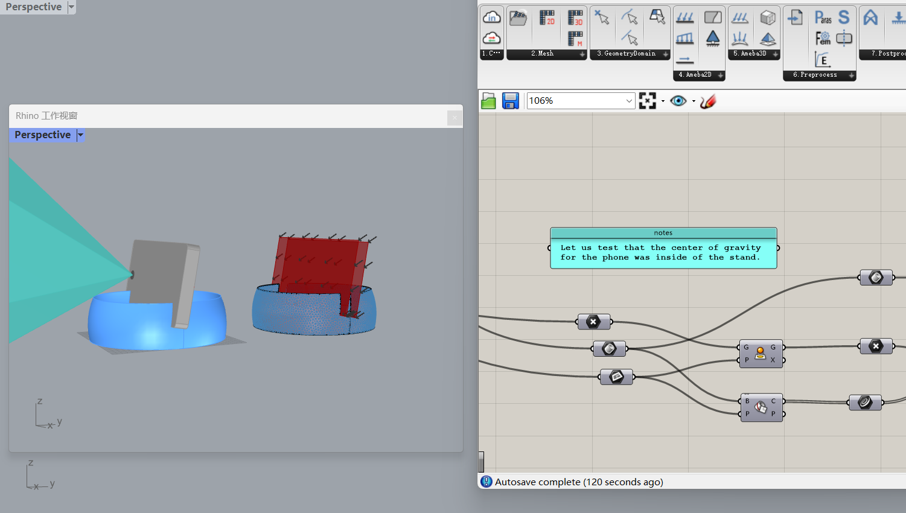
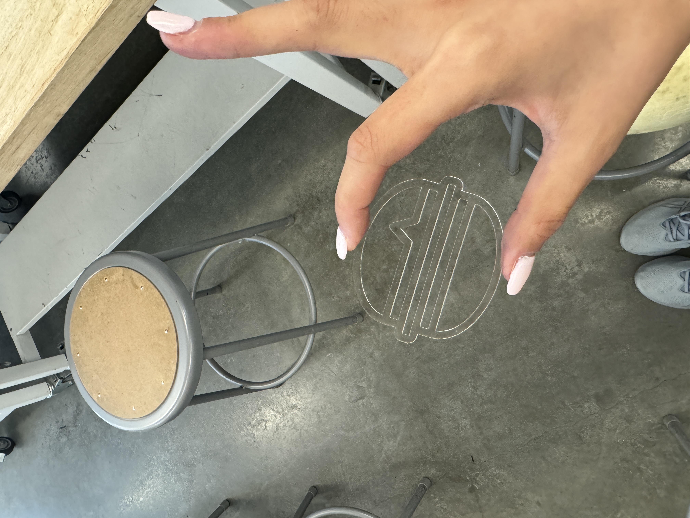
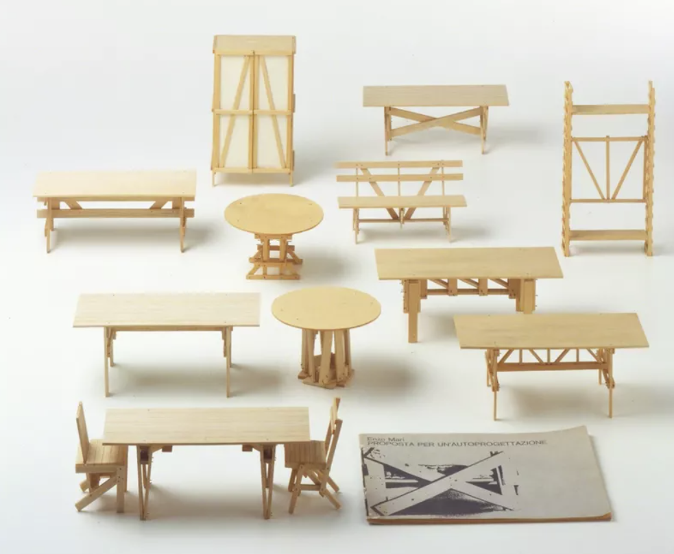

# WeeklyReport003🧐

## Clara(Xuechun) Zang💭20230907

---

This week, I followed my teacher's video to adjust the parameters of the phone holder and tested its gravity stability, which means whether the phone will overturn on the holder.🥳

After completing this video tutorial, I realized that when watching other classmates do 3D printing in the makerspace, most of models used resulted in a lot of material waste. Therefore, I want to use some methods to optimize the shape in order to achieve the goal of material conservation.

---

This reminds me of the application of Grasshopper in structural optimization, using the AMEBA plugin to optimize existing forms based on the structure. First, the surface needs to be subdivided before conducting force analysis, and then the data is transmitted to the cloud for generation.

However, this has also caused me some problems, which is that I cannot determine the approximate stress values of each force point when calculating the stress on the mobile phone. Perhaps next week I will focus on solving this problem.

In addition, this week I have also been helping classmates privately to solve basic problems with Grasshopper. Helping my classmates has given me a great sense of achievement, perhaps this is the power of diversity in the academy! (eg. I helped Yani understand the relationship between surface and image texture.)

Reflective: I am glad that I was inspired by TJ's gravity stability test and extended it to a deeper research direction on a small phone stand. This is the charm of products and the refined design field derived from small-scale objects.

# WeeklyReport001🥽

---

## Clara(Xuechun) Zang💭20240905

---

As I had already mastered the use of Rhino and GH during my undergraduate studies, I focused this week's learning on the use of laser-cutting machines. Although we encountered some unexpected small problems, my classmates and I successfully completed the process of learning the basic principles, testing, and actual operation. We also learned the details that are easily overlooked in the process of using laser-cutting machines. 😈Devils are in the details!!

🛠️Tough I have done the laser-cutter quiz. However, in actual operation, I still tend to overlook many details, such as properly measuring the material thickness, turning on and off the machine, inputting material thickness, and determining the starting point for the machine cutting, etc…

🛠️The first time I printed, I didn't pay attention to the thickness of the wood. So the photo stand is too thick to bend, so I didn't made it the first time.

Later, I tried another material and then print a small Burger successfully.

---

# Speculations

> Enzo Mari
> 

This week I discovered **Enzo Mari**, a furniture designer, and it was he who inspired my interest in making models. I also realized how the concepts of architecture and parametric design flow into small-scale product design, creating an unlimited fusion of knowledge without boundaries.

# Hello DES INV 202 Student!
Welcome to your new GitHub repository! 

# Outline
[week 1](README.md#week-1-example-report-1)

week 2, etc...

---

# Github Background Information & Context
If you’re new to GitHub, you can think of this as a shared file space (like a Google Drive folder, or a like a USB drive that’s hosted online.) 

This is your space to store project files, videos, PDFs, notes, images, etc., and (hopefully, neatly) organize so it's easy for viewers (and you!) to navigate. That said, it’s super easy for you to share any file or folder with us (your TDF instructional team) - just send us the link!  As a start, feel free to simply add images to the `/assets` folder, which is located [here](/assets). 

The specific file that I’m typing into right now is the **README.md** for this repo. 
##### (💡 TIP: The .md indicates that we’re using [Markdown formatting.](https://www.markdownguide.org/cheat-sheet/)) #####
<h6> (💡 TIP 2: GitHub Markdown supports <a href="https://gist.github.com/seanh/13a93686bf4c2cb16e658b3cf96807f2"> <em>HTML formatting</em> too, including emojis 😄</a>, in case that helps!) </h6>

### :star: Whatever you write in your **README.md** will show up on the “front page” of your GitHub repo. This is where we’ll be looking for your [weekly progress reports](https://github.com/Berkeley-MDes/24f-desinv-202/wiki/3.0-Weekly-Submissions#weekly-progress-report). They might look something like this: ###

# Week 1: Example Report 1 #
## Week of 09/05/2024

This week, I designed a cool phone stand made of rocks. Check out all my cool sketches and progress photos from this week below, etc., etc....

---

It's time to start making this space your own! If you want to save these instructions, make a copy.  Also, feel empowered to delete everything in this README.md and start documenting! 

Excited to work with you,
your TDF teaching team

PS: let us know if you have any questions!!

PPS: 

## Quick Links, compiled here for your convenience: ##

- [TDF Wiki](https://github.com/Berkeley-MDes/24f-desinv-202/wiki) - the ultimate source for truth and information about the course and assignments
- [Google Drive Folder](https://drive.google.com/drive/u/0/folders/1DJ1b6sSDwHXX6NRcQYt10ivyQSgU0ND6) - slides and other resources
- [bCourses](https://bcourses.berkeley.edu/courses/1537533) - where the grading happens
