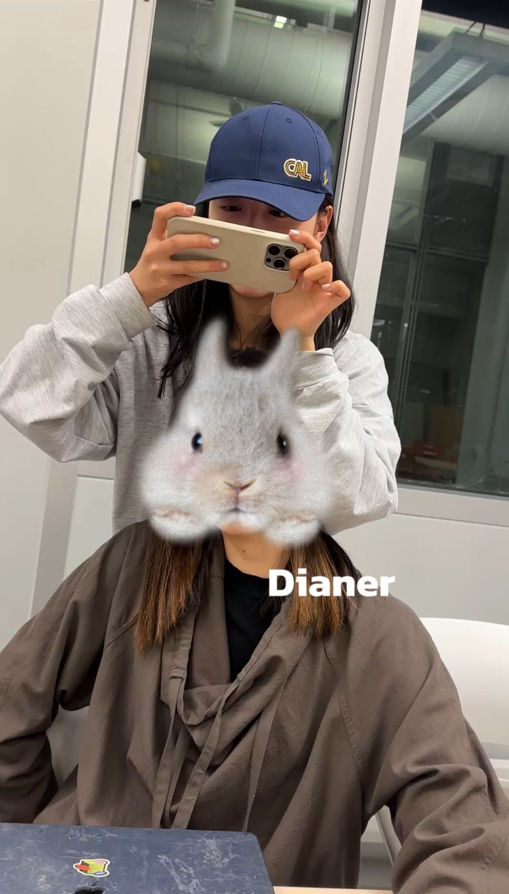

# Weekly Report 007

This week we completed the submission of the proposal, and we are going to explore controllers. Since I have never worked with Arduino or Photon before, I am very nervous and afraid I won't be able to help the group complete the task.

However, I'm very grateful for Yingying and Dianer's encouragement and help. We also had separate meetings with Jeff and Suhdu.

First, we tested each controller individually, then we hoped to test them together.

I was responsible for the haptic motor and vibrator parts, and successfully got them to work. （https://youtu.be/93iBPSG53Z0?si=YyI0P1XLhoHLBqMS）But later we wanted to minimize the number of components involved, so we decided to remove the haptic motor and use only the vibrator for vibration alerts.

（https://youtu.be/Za99rDB4UxI?si=vqxLsrmtznKsWwth）
Then we tested the lights and vibration separately and ensured they could run synchronously.

Next, we plan to integrate them together and try to use GPS and ML for acceleration detection and location sharing. At the same time, I'm responsible for modeling the wristband model. I hope we can proceed smoothly to the next step.
