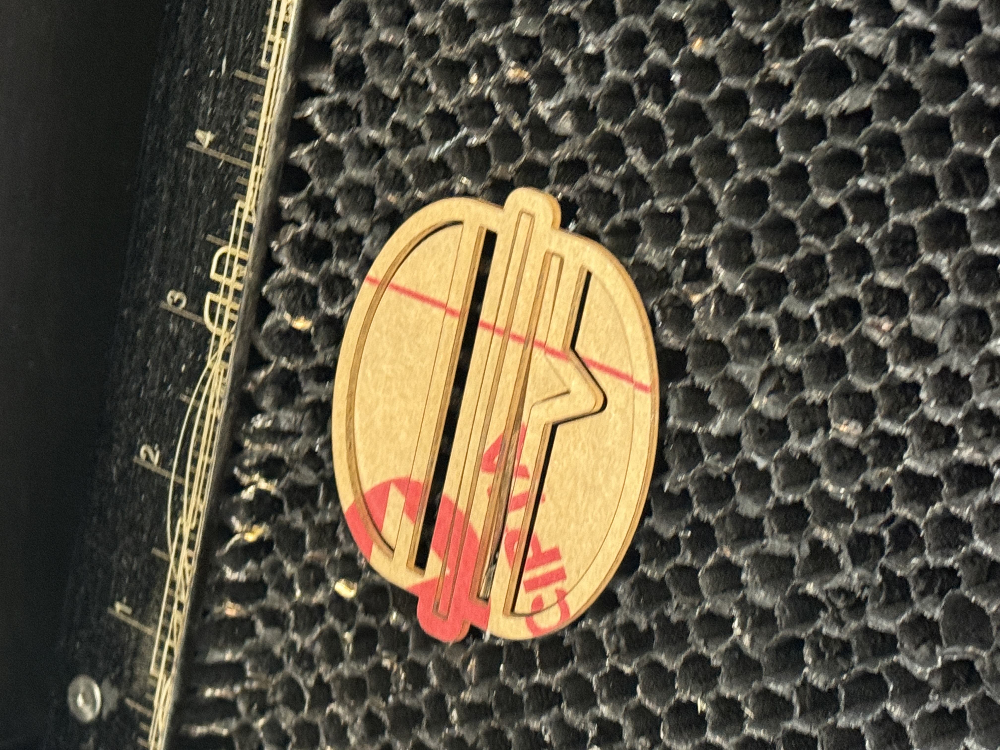
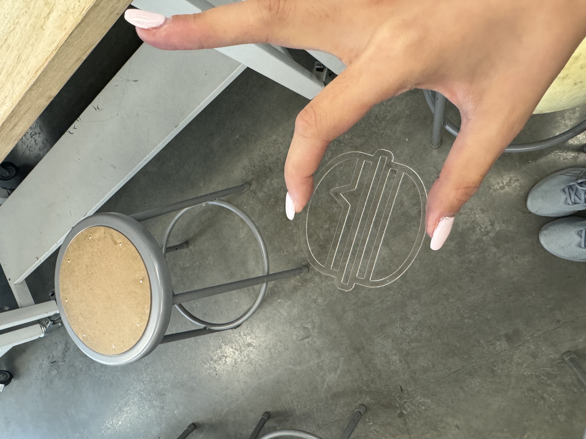
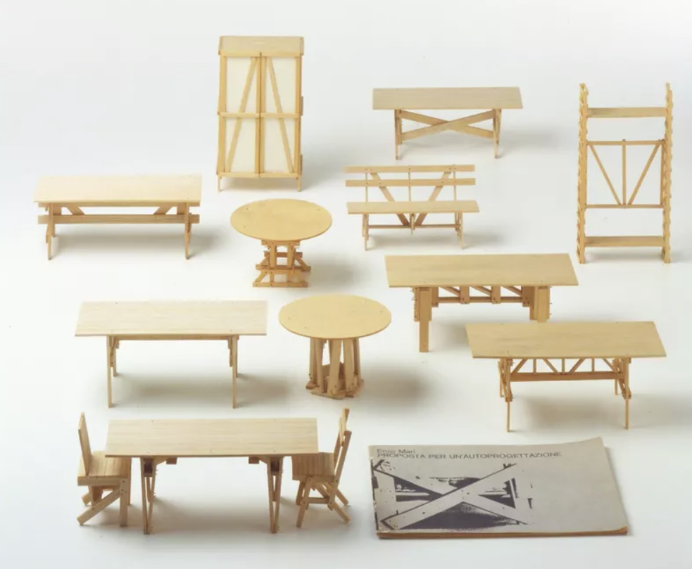

# WeeklyReport001🥽

---

## Clara(Xuechun) Zang💭20240905

---

As I had already mastered the use of Rhino and GH during my undergraduate studies, I focused this week's learning on the use of laser-cutting machines. Although we encountered some unexpected small problems, my classmates and I successfully completed the process of learning the basic principles, testing, and actual operation. We also learned the details that are easily overlooked in the process of using laser-cutting machines. 😈Devils are in the details!!

🛠️Tough I have done the laser-cutter quiz. However, in actual operation, I still tend to overlook many details, such as properly measuring the material thickness, turning on and off the machine, inputting material thickness, and determining the starting point for the machine cutting, etc…

🛠️The first time I printed, I didn't pay attention to the thickness of the wood. So the photo stand is too thick to bend, so I didn't made it the first time.

Later, I tried another material and then print a small Burger successfully.

---

# Speculations

> Enzo Mari
> 

This week I discovered **Enzo Mari**, a furniture designer, and it was he who inspired my interest in making models. I also realized how the concepts of architecture and parametric design flow into small-scale product design, creating an unlimited fusion of knowledge without boundaries.

