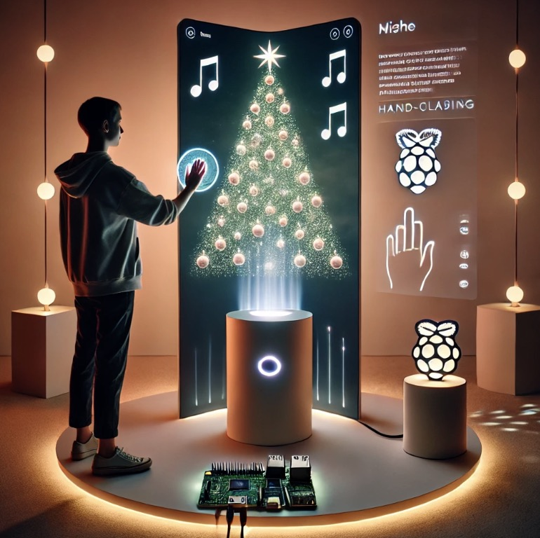

### The four of us finally settled on two proposals. Although everyone had different preferences, I particularly like the **Whisper Wish concept. I completed this proposal together with Dianer.**

### Proposal 1: **"Whisper Wish Installation"**

- **Introduction:** Uses Photon and Raspberry Pi to create an immersive and poetic experience where individual wishes are transformed into personalized visual and auditory memories.
- **Key Features:**
    - Integration of **gesture recognition**, **voice processing**, and **generative content**.
    - Focus on creating a **magical and reflective interaction**.
    - Connects audience emotions with tangible and personalized outputs.

### Proposal 2: **"Mirror-like Interactions"**

- **Core Idea:** Reflects the interpersonal dynamic of seeing oneself in others through an interactive installation.
- **Key Features:**
    - Participants engage in a familiar activity (e.g., sharing a meal) in front of a screen.
    - A **blurry avatar** initially performs different actions but gradually mirrors the participant's movements and transforms into their likeness.
    - The transition from a generic figure to a clear self-image symbolizes the idea of discovering oneself through others.

---

### Speculation:

1. **Emotional Impact:**
    - Proposal 1: Aims for a deeply **personal and emotional connection**, encouraging self-expression and reflective thought about individual wishes.
    - Proposal 2: Focuses on **interpersonal connections** and mutual understanding, offering a metaphorical exploration of identity.
2. **Technological Feasibility:**
    - Proposal 1: Relies on advanced **multi-modal sensing and generative algorithms**, requiring robust integration of hardware and software.
    - Proposal 2: Involves **motion tracking** and **adaptive visual rendering**, which may be simpler to implement but still requires precision for mirroring effects.
3. **Audience Engagement:**
    - Proposal 1: Individual-centered, offering a more private and personalized experience.
    - Proposal 2: Could involve group dynamics, fostering shared experiences and dialogues about identity and relationships.

---

### Conclusion:

Both proposals explore themes of **self-reflection and connection**, but from different perspectives. Proposal 1 emphasizes **personal introspection** through wish-making, while Proposal 2 explores **interpersonal dynamics** through mirroring.

- **Proposal 1** might resonate more with audiences seeking an **internal, magical journey**.
- **Proposal 2** offers a broader **social narrative**, potentially sparking conversations about identity and relationships.

Ultimately, the choice depends on whether the focus is on **personalization and individual emotion** (Proposal 1) or **interaction and mutual discovery** (Proposal 2).
