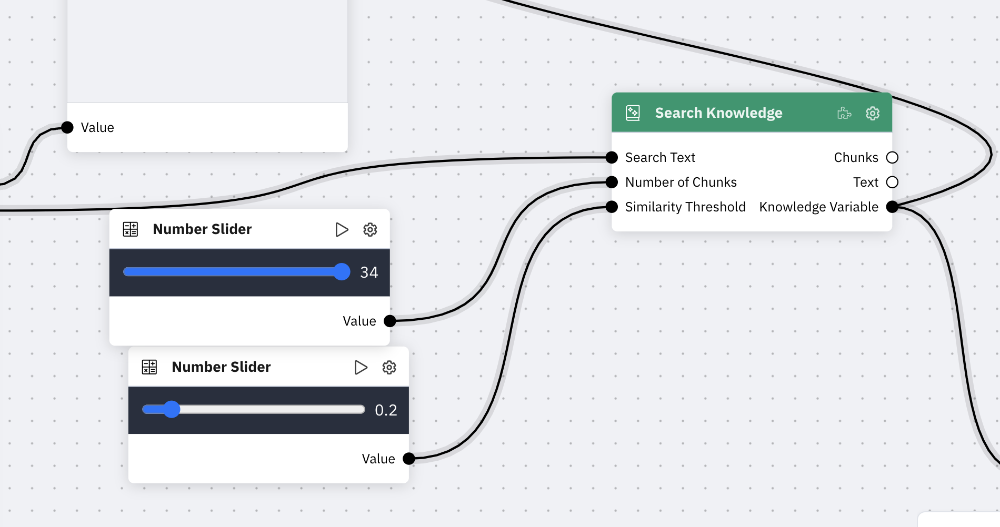
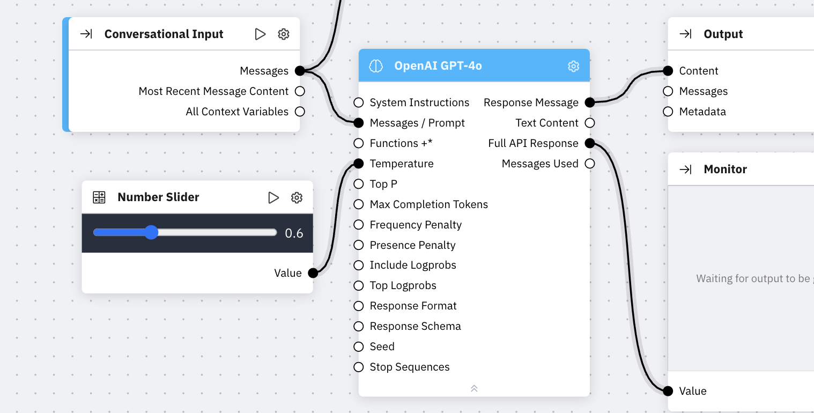
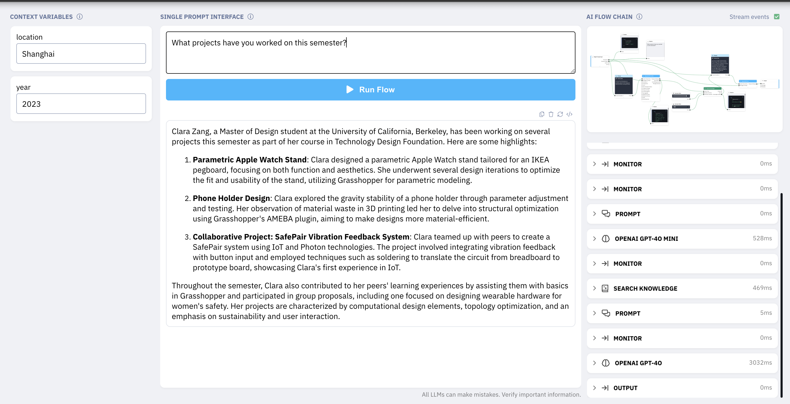
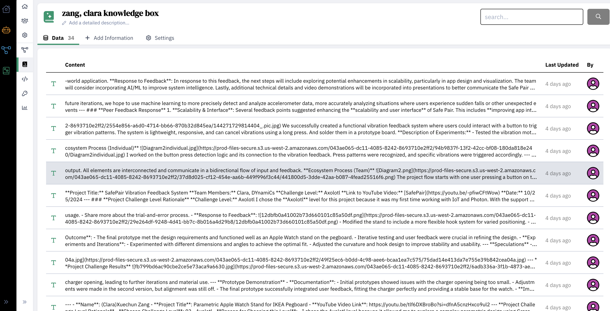

# Weekly Report

This week, I worked on the Zerowidth assignment with Dianer. We collaborated closely, helping each other solve the issues we encountered during the experiments.

The first issue arose when Dianer noticed that complex questions often resulted in garbled responses in the initial experiments. Eventually, I discovered that the problem was due to his number slider being set too high. With such high values, the system struggled to process incomplete information, leading to errors. Once we adjusted the number slider to a lower setting, even complex questions could be handled effectively in the first three experiments.

The second issue occurred during my initial attempt at using the knowledge base for answering questions. Despite successfully importing all relevant materials, the system still didn’t respond based on my experiences. Dianer then realized that the chunk size on my number slider was set too low, limiting the retrieval to only the first three chunks. This mismatch caused the system to respond inaccurately. Once I increased the slider to encompass all relevant chunks, the responses became much more aligned with my input.

Finally, I noticed that the responses in the third experiment tended to be overly complex. To address this in the final experiment, I introduced additional variables to adjust the tone and style of the responses, allowing for greater flexibility and control over the output.

