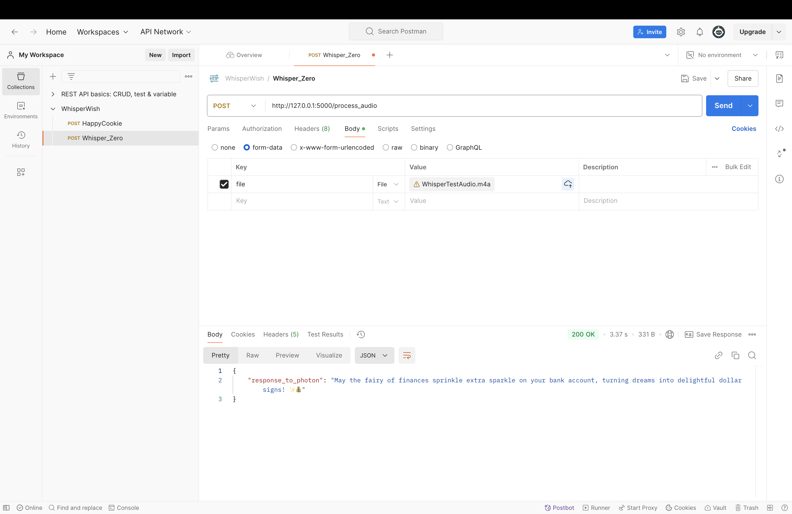

### Weekly Report

#### **Tasks and Goals**
This week, my primary goal was to create a system where the Particle Photon collects audio input through a microphone, sends the audio to a Flask-based Whisper API for transcription, and then forwards the transcribed text to Zerowidth to generate a response. To achieve this, I focused on three key tasks:
- Developing a Flask server to host the Whisper transcription API locally.
- Configuring the Zerowidth API for seamless text-based interactions.
- Writing Photon code to handle HTTP requests for sending and receiving data.

#### **Challenges and Obstacles**
1. **Technical Issues**:  
   I encountered several challenges, starting with running the Flask server. Managing the virtual environment and ensuring all dependencies were installed correctly took more time than expected. Networking issues also arose, such as finding the correct IP address and ensuring the Flask server was accessible over the local network. Additionally, I faced file format compatibility problems when uploading `.m4a` files to the Whisper API via Postman. Debugging the Photon’s HTTP client implementation was another hurdle, as I had to ensure accurate data exchange between the Photon, Flask, and Zerowidth APIs.

2. **Learning Curve**:  
   Working with multiple tools and technologies—Flask, Photon IDE, Postman, and Zerowidth—required significant effort to learn and troubleshoot. Understanding and implementing webhooks and API integrations for a smooth workflow was particularly challenging but rewarding.

3. **Time and Effort**:  
   Iterative debugging became a major time investment. Each time I updated the Flask server, I had to restart it and recheck the configuration. Issues like mismatched file paths and missing dependencies across environments added to the workload.

#### **Progress and Achievements**
Despite the challenges, I made considerable progress:
1. I successfully deployed a **locally hosted Flask server** running Whisper, capable of processing and transcribing audio files.
2. Using **Postman**, I resolved file upload issues by correctly configuring content types and formats for the Whisper API.
3. I enabled the Photon to **send and receive HTTP requests**, allowing it to interact with both the Whisper and Zerowidth APIs.
4. I completed the **end-to-end system workflow**, which includes:
   - Capturing audio on the Photon and sending it to Whisper.
   - Whisper transcribing the audio and returning the text to the Photon.
   - The Photon forwarding the transcribed text to Zerowidth and receiving a contextual response.

#### **Reflections**
1. **Adaptability and Persistence**:  
   Overcoming unexpected issues, such as missing dependencies and network configuration errors, underscored the importance of patience and adaptability. Breaking down the problem into smaller, manageable parts helped me solve issues more effectively.

2. **Value of Testing**:  
   Testing each component separately was crucial. For example, verifying the Flask API endpoints with Postman before integrating them with the Photon saved time and helped isolate specific issues.

3. **Networking and System Design**:  
   I gained a deeper understanding of local server configurations, IP management, and HTTP protocols, which proved essential for building and testing the system.

#### **Conclusion**
This project has been a rewarding experience in IoT integration, API development, and system design. Although the initial challenges were time-consuming, careful debugging and incremental testing led to significant progress. I’m proud of the functional system I built, which connects hardware (Photon), AI capabilities (Whisper), and conversational intelligence (Zerowidth). This week’s work has strengthened my problem-solving skills and taught me valuable lessons about designing robust and interconnected systems.
