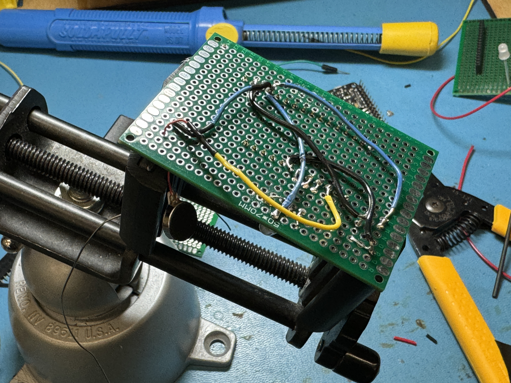
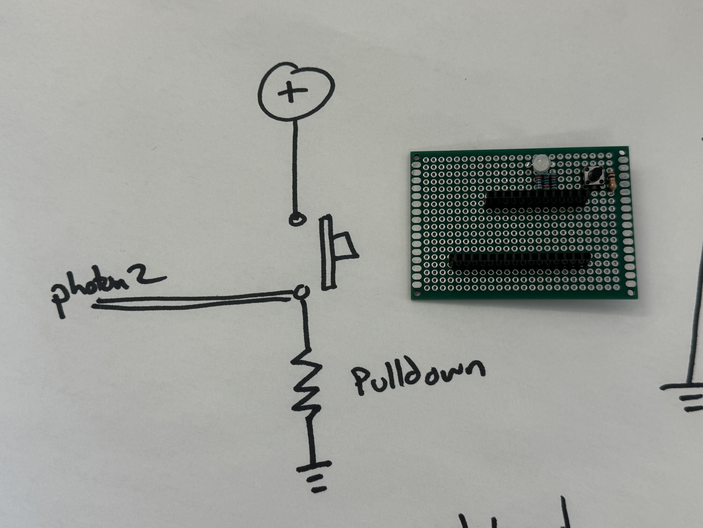
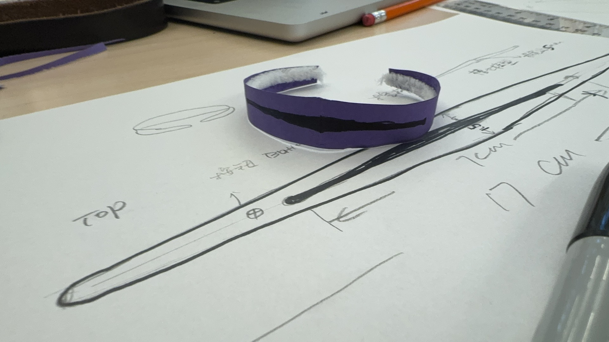
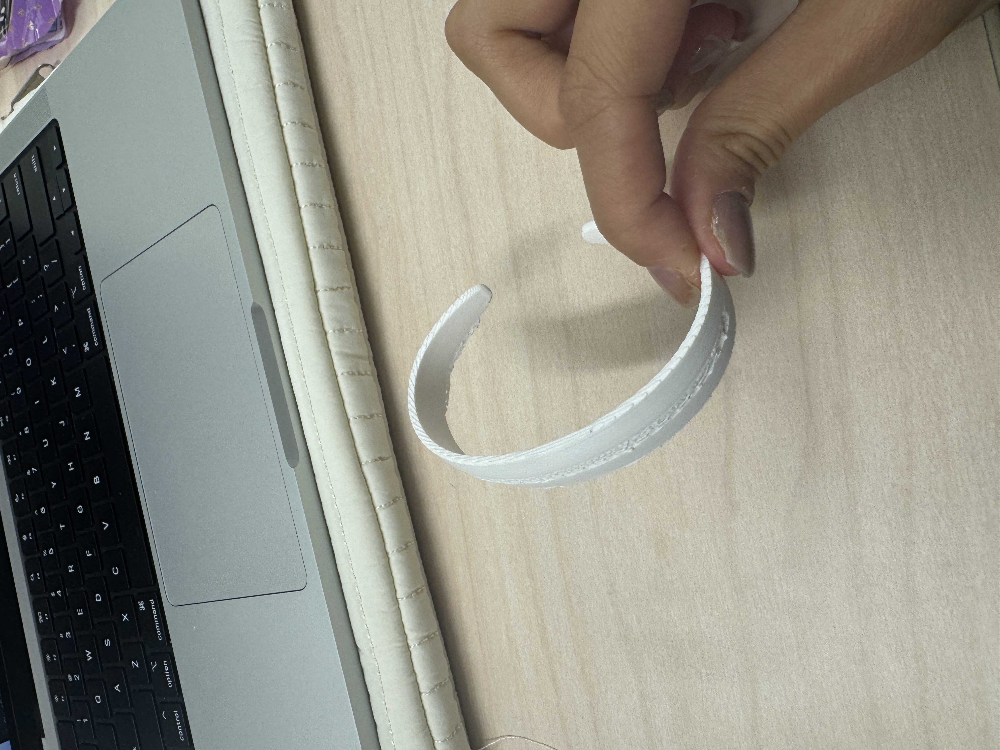
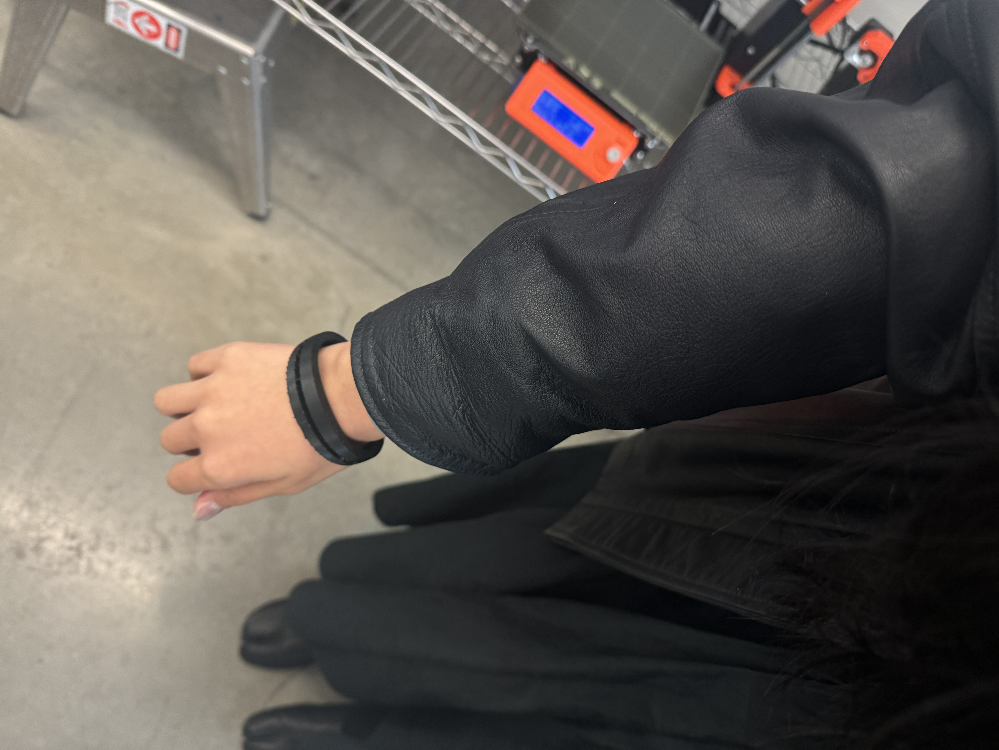
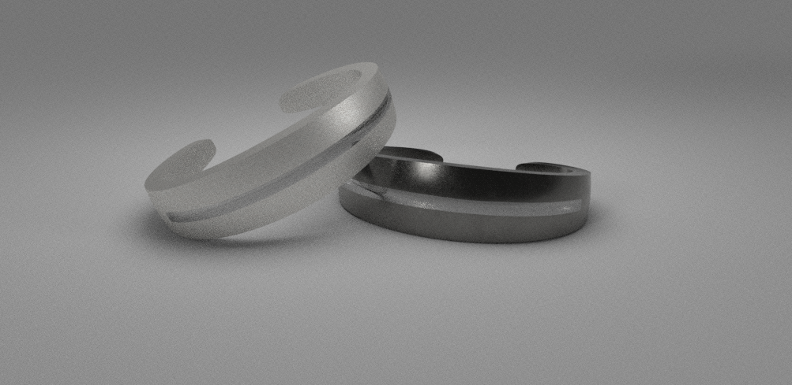

**Weekly Report**

This week is the final week before our photon project submission. We want to further integrate our breadboard prototype by transferring the circuit to a prototype board using soldering. We scheduled an office hour with Sudhu last Friday to learn the basics of soldering. At this point, I was still quite nervous. For someone like me with no photon experience, soldering independently was indeed a challenge, as we had no way of knowing if the circuit would work properly until the soldering was completely finished. To achieve a more aesthetically pleasing final result, we decided to solder the wires on the back.

As expected, problems arose during the process. Unlike breadboards, prototype boards don't have fixed positive and negative current flows. So when connecting the resistors, I was a bit unsure if the circuit connections were correct. But I decided to give it a try based on my understanding.

Just as I finished soldering, Sudhu happened to pass by. Together, we used a voltage tester to verify the correctness of the circuit. Surprisingly, it worked on the first try.

Then I completed the entire circuit soldering and successfully connected the power supply. This gave me a great sense of achievement.

Meanwhile, I also created a wearable bracelet prototype for our project. Although I know how to model, this was my first time making jewelry. I went through some design and iteration processes as follows.

Later, we shot the final demonstration video together and edited it. I'm really looking forward to seeing everyone's projects in class soon.

