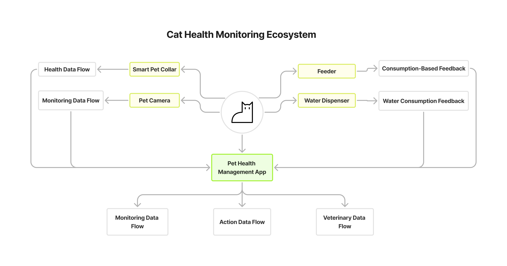

# Weekly Report004

### Cat Health Monitoring Ecosystem

---

**Brief Explanation：**

The Cat Health Monitoring Ecosystem integrates various smart devices to provide a comprehensive view of a cat's health and well-being. The Smart Cat Collar, Water Dispenser, Feeder, and Camera all send data to the central Cat Health Management App, which analyzes the information and provides health recommendations. The system includes feedback loops that automatically adjust care routines based on real-time data and historical health records, ensuring the cat remains healthy and active even in the owner's absence.

**Speculation:**

---

**Beyond Basic Health Monitoring**

Future pet health systems could incorporate emotional connectivity features, enabling deeper interaction between pets and owners. Smart devices might detect not only a cat's physical health but also its emotional state through behavior analysis and vocal recognition. For example, if a cat shows signs of loneliness or anxiety when the owner is away, the system could initiate remote play sessions, send voice messages from the owner, or even deploy interactive toys to provide comfort. This emotional feedback loop would strengthen the human-pet bond, ensuring not just physical well-being but also emotional support and companionship.
