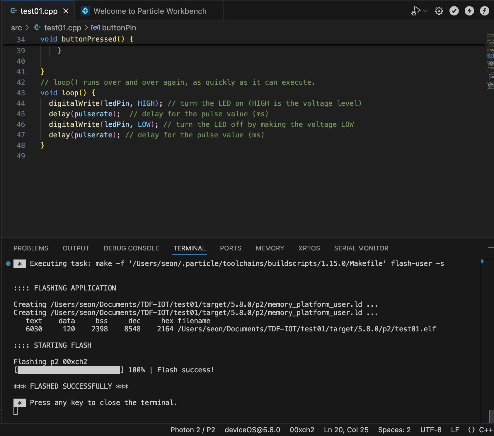
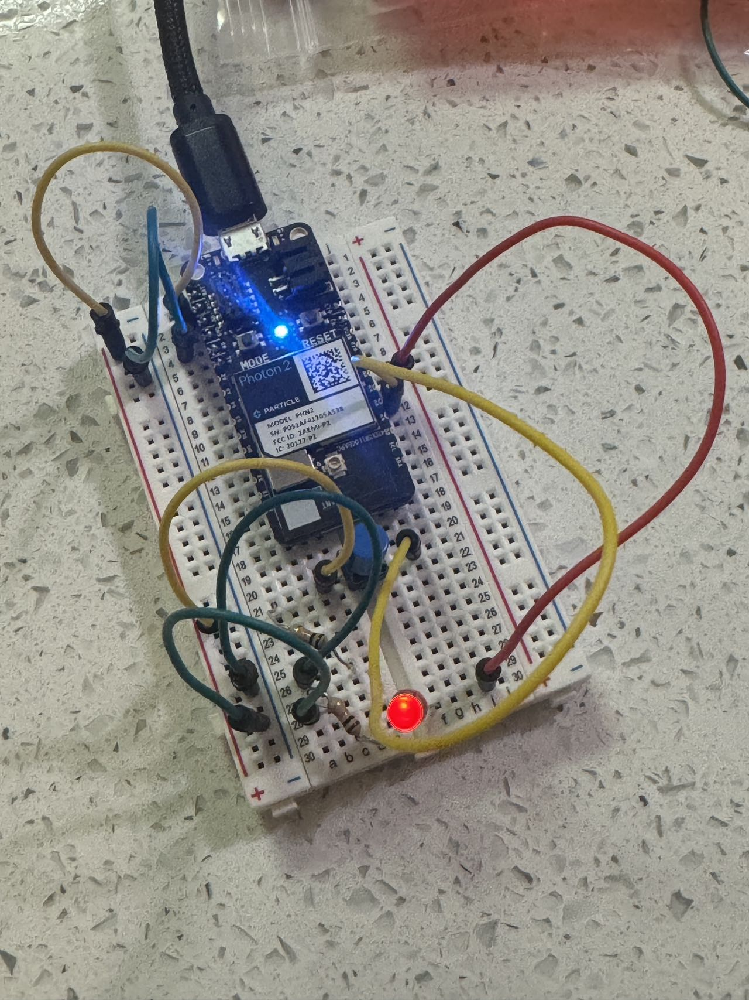
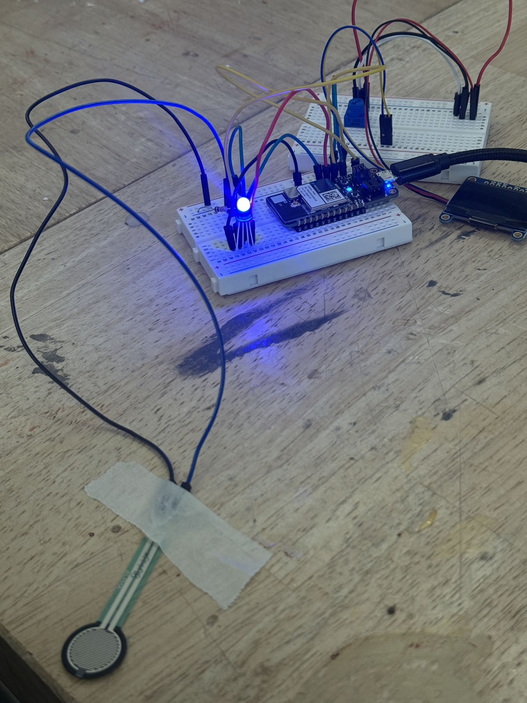

# Weekly Report005

This week I started using Photon2. I am totally new to this and encountered some difficulties during the process. Fortunately, with the help of my friends, I managed to solve some of them.

First, I tried running some simple code. I changed the parameters, and this step went quite smoothly.

Then, in the homework assigned on Monday, we needed to connect a breadboard to try more complex code, but I encountered some difficulties with this step. Among these, I successfully completed the operation of the first button controlling the flashing frequency,

However, I encountered some problems with the OLED connection and the code for changing colors with the FSR.(which I think is similar as Mia asked in slack channel) I hadn't resolved these issues before Thursday morning, so I plan to go to Jacobs Hall in the afternoon to seek more specific help.

