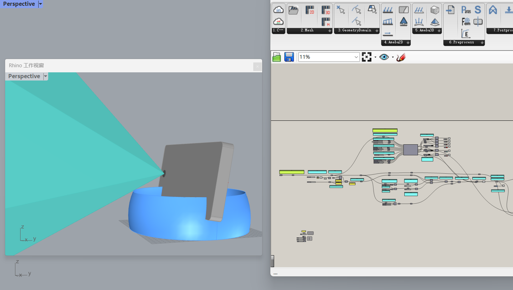
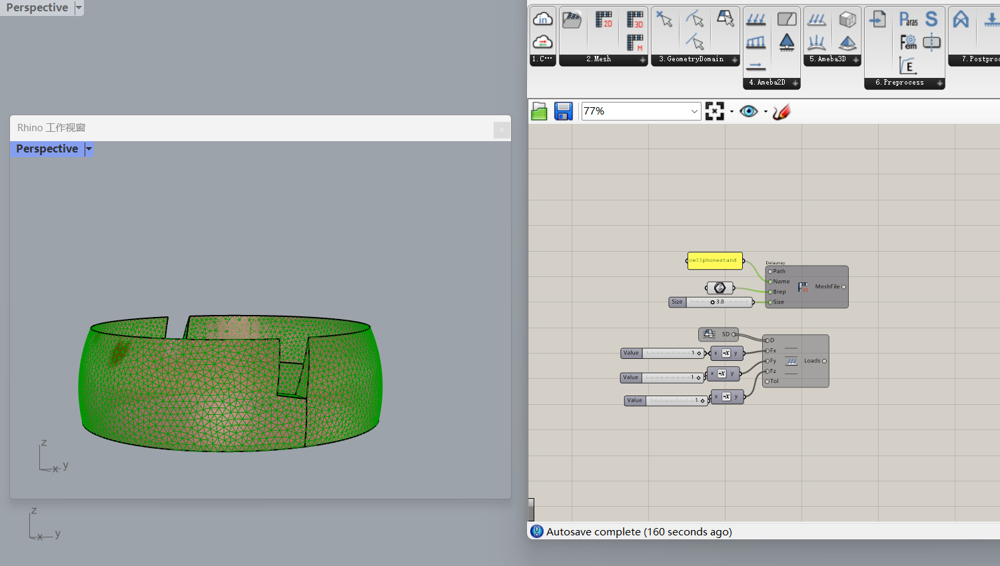
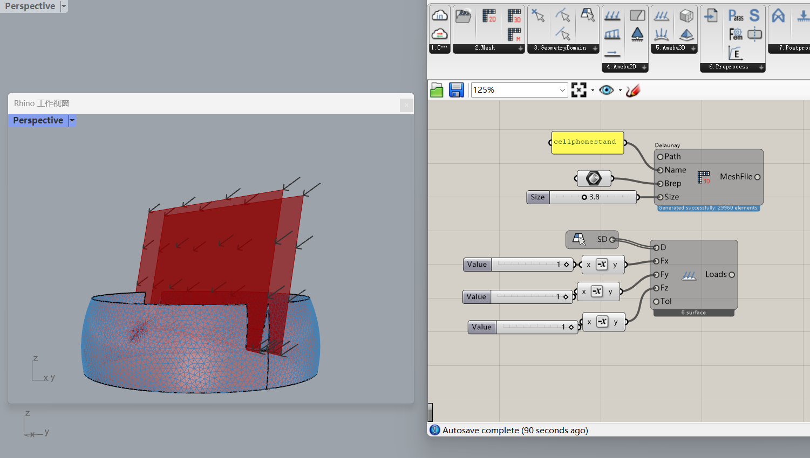
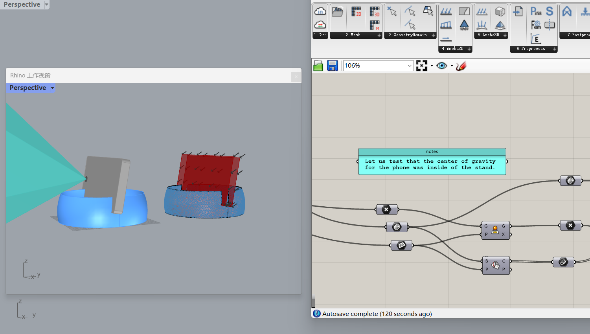

# WeeklyReport003🧐

## Clara(Xuechun) Zang💭20230907

---

This week, I followed my teacher's video to adjust the parameters of the phone holder and tested its gravity stability, which means whether the phone will overturn on the holder.🥳

After completing this video tutorial, I realized that when watching other classmates do 3D printing in the makerspace, most of models used resulted in a lot of material waste. Therefore, I want to use some methods to optimize the shape in order to achieve the goal of material conservation.

---

This reminds me of the application of Grasshopper in structural optimization, using the AMEBA plugin to optimize existing forms based on the structure. First, the surface needs to be subdivided before conducting force analysis, and then the data is transmitted to the cloud for generation.

However, this has also caused me some problems, which is that I cannot determine the approximate stress values of each force point when calculating the stress on the mobile phone. Perhaps next week I will focus on solving this problem.

In addition, this week I have also been helping classmates privately to solve basic problems with Grasshopper. Helping my classmates has given me a great sense of achievement, perhaps this is the power of diversity in the academy! (eg. I helped Yani understand the relationship between surface and image texture.)

Reflective: I am glad that I was inspired by TJ's gravity stability test and extended it to a deeper research direction on a small phone stand. This is the charm of products and the refined design field derived from small-scale objects.

